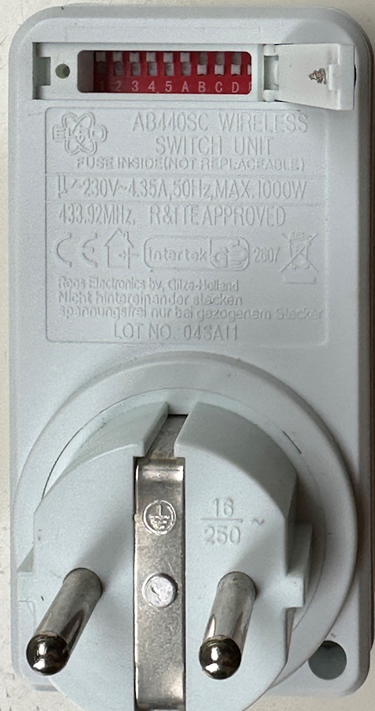

### ELRO switch AB440R with Arduino

# Control ELRO AB440R switches with Arduino  

I have these ELRO AB440R switches (now sold as Brennenstuhl Comfort RCS 1000 N)  
for more than 10 years but you need the ELRO AB440SC remote controller to switch 
them On and Off.  
In the remote control a 433 MHz transmitter is used to send the commands.  
[Lastminuteengineers](https://lastminuteengineers.com/433mhz-rf-wireless-arduino-tutorial/) explains how 
this works.  
This is a compilation of my research to get the switches working with Arduino's.  


I used the FS1000 transmitter to send the data to the ELRO switch and XY-MK-5V 
receiver to display the transmitted data on a separate Arduino. They can be 
bought very cheap together

For the ELRO switches to be switched On and Off a specific pulse signal 
must be sent preceded with an unique switch number.  
In the ELRO remote control five dip switches can be set. They must be identical with 
the five dip switches in the powerswitches. 
I had the 5 dip switches all all turned ON.  
In the switch there are beside the five dip switches also dip  switches A, B, C, D and E. 
These last five identify the switch.  
The signal send to a switch has as preamble the state of the first 5 dip switches. 
For example: mySwitch.switch**On**("11111", "10000"), turns on switch A.  
                        mySwitch.switch**Off**("11111", "10000"), turns on switch A.

All kind of Arduino's can be used. The cheap 168P Nano is perfect but the in 
2023 released, ESP32 Nano also works fine.  
The transmitter works fine at 5V. For a large transmission range attach a 17.3 
cm (6.8 inch) wire to the transmitter and receiver. It is said a straight, not 
coiled, wire gives the best results.

.png)

Make the following connections.

On transmitter: Connect GND to GND and VCC to 5V or VIN. Middle pin to D10

On receiver:      Connect GND to GND and VCC to 5V or VIN. One of the two middle pins, 
both are identical, to D2.  

Antennas should be exactly 17.3 cm long (6.8 inches).

Place the switches in separate power outlets; do not stack them in a single socket. (-: .  

If you power up the Arduino you can hear and see the switches switching.

|  |  |  |
|---|---|---|
|  |  |  |

Arduino code for sending to switches

```
/*
  Example for receiving:   https://github.com/sui77/rc-switch/
  If you want to visualize a telegram copy the raw data and paste it into http://test.sui.li/oszi/
*/

#include <RCSwitch.h>

RCSwitch mySwitch = RCSwitch();

void setup() 
{
 delay(250);
Serial.begin(115200);
delay(250);
Serial.println("Send-ELROV03");
Serial.println("Turns at the start OFF Then On and again OFF all four ELRO devices");
Serial.println("First 5 DIP switches ON ON ON ON ON");
Serial.println("The turns ON for 5 seconds and OFF ELRO devices A, B and D in a loop");

  mySwitch.enableTransmit(10);  // Transmitter is connected to Arduino Pin #10  
//   mySwitch.setPulseLength(320);  // Optional set pulse length.
 Serial.println("All Switches OFF");
 mySwitch.switchOff("11111", "10000");
 mySwitch.switchOff("11111", "01000");
 mySwitch.switchOff("11111", "00100");
 mySwitch.switchOff("11111", "00010");
 delay(100); 
  Serial.println("All Switches ON");
 mySwitch.switchOn("11111", "10000");
 mySwitch.switchOn("11111", "01000");
 mySwitch.switchOn("11111", "00100");
 mySwitch.switchOn("11111", "00010");
 delay(100); 
 Serial.println("All Switches OFF");
 mySwitch.switchOff("11111", "10000");
 mySwitch.switchOff("11111", "01000");
 mySwitch.switchOff("11111", "00100");
 mySwitch.switchOff("11111", "00010");
 delay(100); 

}

void loop() 
{
int d =5000;
  delay(d);
  mySwitch.switchOn("11111", "10000");  Serial.println("Switch A ON");
  delay(d); 
  mySwitch.switchOff("11111","10000");  Serial.println("Switch A OFF");
  delay(d); 
  mySwitch.switchOn("11111", "01000");  Serial.println("Switch B ON");
  delay(d); 
  mySwitch.switchOff("11111","01000");  Serial.println("Switch B OFF");
  delay(d); 
  mySwitch.switchOn("11111", "00010");  Serial.println("Switch D ON");
  delay(d); 
  mySwitch.switchOff("11111","00010");  Serial.println("Switch D OFF");

}
```

```
static const char* bin2tristate(const char* bin);
static char * dec2binWzerofill(unsigned long Dec, unsigned int bitLength);

void output(unsigned long decimal, unsigned int length, unsigned int delay, unsigned int* raw, unsigned int protocol) {

  const char* b = dec2binWzerofill(decimal, length);
  Serial.print("Decimal: ");
  Serial.print(decimal);
  Serial.print(" (");
  Serial.print( length );
  Serial.print("Bit) Binary: ");
  Serial.print( b );
  Serial.print(" Tri-State: ");
  Serial.print( bin2tristate( b) );
  Serial.print(" PulseLength: ");
  Serial.print(delay);
  Serial.print(" microseconds");
  Serial.print(" Protocol: ");
  Serial.println(protocol);

  Serial.print("Raw data: ");
  for (unsigned int i=0; i<= length*2; i++) {
    Serial.print(raw[i]);
    Serial.print(",");
  }
  Serial.println();
  Serial.println();
}

static const char* bin2tristate(const char* bin) {
  static char returnValue[50];
  int pos = 0;
  int pos2 = 0;
  while (bin[pos]!='\0' && bin[pos+1]!='\0') {
    if (bin[pos]=='0' && bin[pos+1]=='0') {
      returnValue[pos2] = '0';
    } else if (bin[pos]=='1' && bin[pos+1]=='1') {
      returnValue[pos2] = '1';
    } else if (bin[pos]=='0' && bin[pos+1]=='1') {
      returnValue[pos2] = 'F';
    } else {
      return "not applicable";
    }
    pos = pos+2;
    pos2++;
  }
  returnValue[pos2] = '\0';
  return returnValue;
}

static char * dec2binWzerofill(unsigned long Dec, unsigned int bitLength) {
  static char bin[64]; 
  unsigned int i=0;

  while (Dec > 0) {
    bin[32+i++] = ((Dec & 1) > 0) ? '1' : '0';
    Dec = Dec >> 1;
  }

  for (unsigned int j = 0; j< bitLength; j++) {
    if (j >= bitLength - i) {
      bin[j] = bin[ 31 + i - (j - (bitLength - i)) ];
    } else {
      bin[j] = '0';
    }
  }
  bin[bitLength] = '\0';

  return bin;
}
```

Arduino code for receiving

```
/*
  Example for receiving
  https://github.com/sui77/rc-switch/
  If you want to visualize a telegram copy the raw data and paste it into http://test.sui.li/oszi/
*/

#include <RCSwitch.h>
#define CONCATLINES   
RCSwitch mySwitch = RCSwitch();

void setup() {
  Serial.begin(115200); 
Serial.println("ReceiveDemo_Advanced V02");  
Serial.println("Print the received strings on the 433 MHz receiver"); 
  mySwitch.enableReceive(0);  // Receiver on interrupt 0 => pin #2
}

void loop() {
  if (mySwitch.available()) 
  {
    output(mySwitch.getReceivedValue(), mySwitch.getReceivedBitlength(), mySwitch.getReceivedDelay(), mySwitch.getReceivedRawdata(),mySwitch.getReceivedProtocol());
    Serial.print(":");
    mySwitch.resetAvailable();
  }
}
```


References:

[Using 433MHz Remote Controlled Switches on Arduino : 10 Steps - Instructables](https://www.instructables.com/Using-433MHz-Remote-Controlled-Switches-on-Arduino/)

[Insight Into How 433MHz RF Tx-Rx Modules Work & Interface with Arduino](https://lastminuteengineers.com/433mhz-rf-wireless-arduino-tutorial/)

<-- [Home](https://ednieuw.home.xs4all.nl/Woordklok/index.html)  

